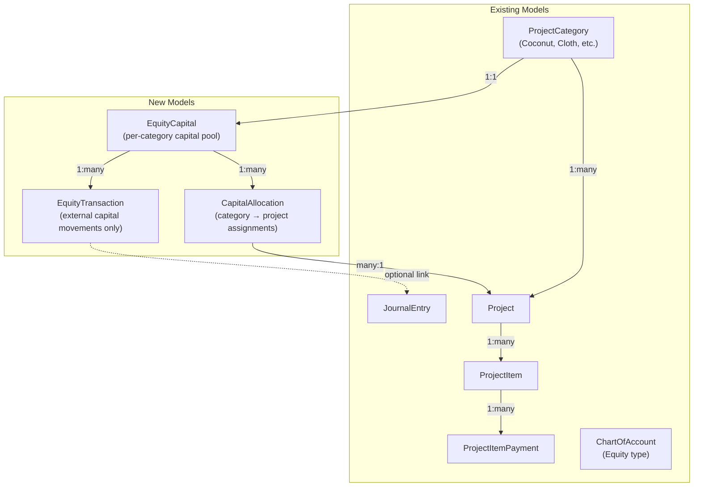
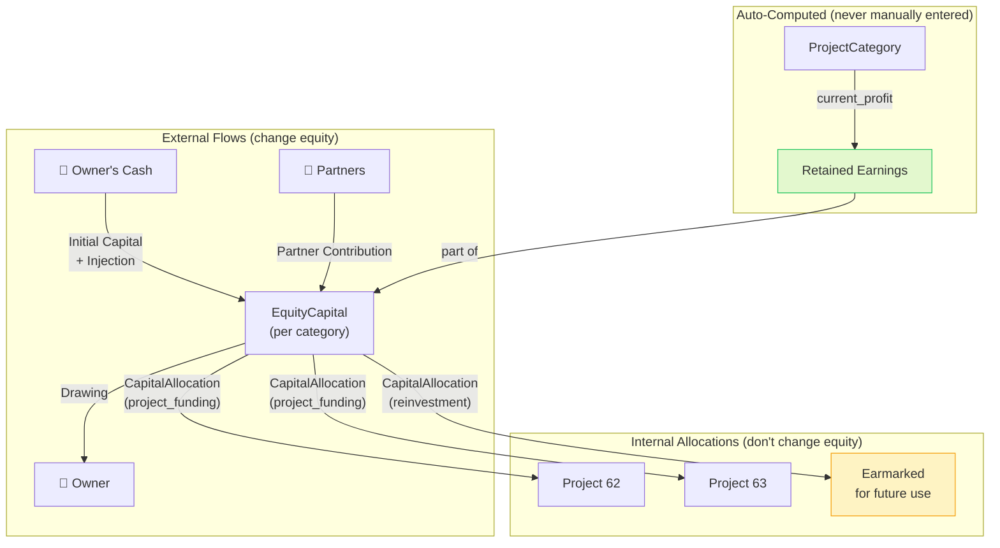

# Equity Capital Implementation Guide (v2)

> **Scope**: Full equity breakdown — initial capital, additional injections, retained earnings, owner's drawings, partner contributions, and **project-level capital allocations** — integrated with your existing **ProjectCategory** business system.

> [!IMPORTANT]
> **v2 Changes from v1:**
> 1. **Fixed double-counting** — reinvestments are now internal allocations of retained earnings, not additive equity
> 2. **Added project-level allocations** — new `CapitalAllocation` model tracks how capital is deployed per project

---

## Corrected Accounting Equation

```
Total Equity = Contributed Capital + Retained Earnings

Where:
  Contributed Capital = Initial Capital
                      + Additional Injections (external cash in)
                      + Partner Contributions
                      - Owner Drawings (cash out)

  Retained Earnings   = category.current_profit
                        (auto-computed from project income − expenses)

  Reinvestments       = internal memo allocations of retained earnings
                        into specific projects/uses (NO equity change)
```

> [!WARNING]
> **Why reinvestments don't increase equity**: A reinvestment says "take GHS 200 of this year's profit and earmark it for the Coconut category's next project." That GHS 200 was *already counted* inside `category.current_profit` (retained earnings). Recording it again as an inflow would double-count it. Instead, reinvestments are tracked as **capital allocations** — they move profit from "unallocated" to "earmarked" without changing the total.

---

## Architecture Overview



---

## Step 1 — New Models

Add these three models to [models.py](file:///c:/Users/HP/Documents/GitHub/FinancialTracker/app/models.py) after the `GlobalEntity` class (~line 1069):

```python
# ===== EQUITY CAPITAL TRACKING =====
class EquityCapital(db.Model):
    """Tracks the equity capital pool for a business category (e.g., Coconut, Cloth).

    Each ProjectCategory gets exactly one EquityCapital record.
    Total equity is computed as:
        contributed_capital + retained_earnings
    where contributed_capital = initial + injections + partner - drawings
    and retained_earnings = category.current_profit (auto-computed, live).

    Reinvestments are NOT equity-changing — they are tracked as
    CapitalAllocations (earmarks of retained earnings into projects/uses).
    """
    id = db.Column(db.Integer, primary_key=True)
    user_id = db.Column(db.Integer, db.ForeignKey('user.id'), nullable=False)
    category_id = db.Column(db.Integer, db.ForeignKey('project_category.id'), nullable=False, unique=True)

    # Initial cash capital when the business was started
    initial_capital = db.Column(db.Float, default=0.0)
    initial_capital_date = db.Column(db.DateTime, nullable=True)

    # Descriptive metadata
    business_name = db.Column(db.String(200), nullable=True)  # Optional alias
    notes = db.Column(db.Text, nullable=True)
    created_at = db.Column(db.DateTime, default=datetime.utcnow)
    updated_at = db.Column(db.DateTime, default=datetime.utcnow, onupdate=datetime.utcnow)

    # Relationships
    category = db.relationship('ProjectCategory', backref=db.backref('equity_capital', uselist=False), lazy=True)
    transactions = db.relationship('EquityTransaction', backref='equity_capital', lazy=True,
                                   cascade='all, delete-orphan', order_by='EquityTransaction.date.desc()')
    allocations = db.relationship('CapitalAllocation', backref='equity_capital', lazy=True,
                                  cascade='all, delete-orphan', order_by='CapitalAllocation.date.desc()')
    user = db.relationship('User', backref=db.backref('_user_equitycapitals', cascade='all, delete-orphan'), lazy=True)

    # ── Contributed Capital (external money in/out) ──────────────

    @property
    def total_additional_injections(self):
        """Sum of external cash put into the business after initial capital."""
        return sum(t.amount for t in self.transactions if t.transaction_type == 'injection')

    @property
    def total_partner_contributions(self):
        """Sum of capital contributed by partners."""
        return sum(t.amount for t in self.transactions if t.transaction_type == 'partner_contribution')

    @property
    def total_drawings(self):
        """Sum of owner's withdrawals/drawings from the business."""
        return sum(t.amount for t in self.transactions if t.transaction_type == 'drawing')

    @property
    def contributed_capital(self):
        """Total external capital = initial + injections + partner - drawings.
        Does NOT include retained earnings or reinvestments (those are internal).
        """
        return (self.initial_capital
                + self.total_additional_injections
                + self.total_partner_contributions
                - self.total_drawings)

    # ── Retained Earnings (auto-computed, never double-counted) ──

    @property
    def retained_earnings(self):
        """Auto-computed from category's current profit (income - expenses).
        This is the cumulative profit the business has generated.
        """
        if self.category:
            return self.category.current_profit
        return 0.0

    # ── Capital Allocations (internal memo entries) ──────────────

    @property
    def total_allocated_to_projects(self):
        """How much capital has been earmarked/deployed to specific projects."""
        return sum(a.amount for a in self.allocations if a.project_id is not None)

    @property
    def total_reinvestment_earmarks(self):
        """How much of retained earnings has been formally earmarked for reinvestment.
        This is a memo allocation, NOT additive to equity.
        """
        return sum(a.amount for a in self.allocations if a.allocation_type == 'reinvestment')

    @property
    def total_allocated(self):
        """Total capital allocated (to projects + general reinvestment earmarks)."""
        return sum(a.amount for a in self.allocations)

    @property
    def allocated_from_contributions(self):
        """Internal allocations funded from the contributed-capital pool."""
        return sum(a.amount for a in self.allocations if a.funding_source == 'capital')

    @property
    def allocated_from_retained_earnings(self):
        """Internal allocations funded from retained earnings."""
        return sum(a.amount for a in self.allocations if a.funding_source == 'retained')

    @property
    def available_contributed_capital(self):
        """Contributed capital that has not yet been internally allocated."""
        return self.contributed_capital - self.allocated_from_contributions

    @property
    def available_retained_earnings(self):
        """Retained earnings that have not yet been internally allocated."""
        return self.retained_earnings - self.allocated_from_retained_earnings

    @property
    def unallocated_capital(self):
        """Total available capital across both funding sources."""
        return self.available_contributed_capital + self.available_retained_earnings

    # ── Total Equity (the one true number) ───────────────────────

    @property
    def total_equity(self):
        """Total owner's equity = contributed capital + retained earnings.
        Reinvestments do NOT add here — they are internal allocations of
        money already counted in retained_earnings.
        """
        return self.contributed_capital + self.retained_earnings

    def __repr__(self):
        return f'<EquityCapital {self.business_name or self.category.name}: {self.total_equity}>'


class EquityTransaction(db.Model):
    """An EXTERNAL capital movement in or out of a business.

    These are real cash flows that change total equity:
    - 'injection'             : Additional cash invested by owner (equity ↑)
    - 'partner_contribution'  : Cash from a partner/co-investor (equity ↑)
    - 'drawing'               : Owner withdrawing money from business (equity ↓)

    NOTE: 'reinvestment' is NOT here — it is tracked via CapitalAllocation
    because it is an internal reallocation of retained earnings, not new equity.
    """
    id = db.Column(db.Integer, primary_key=True)
    user_id = db.Column(db.Integer, db.ForeignKey('user.id'), nullable=False)
    equity_capital_id = db.Column(db.Integer, db.ForeignKey('equity_capital.id'), nullable=False)

    transaction_type = db.Column(db.String(30), nullable=False)
    # One of: 'injection', 'partner_contribution', 'drawing'

    amount = db.Column(db.Float, nullable=False, default=0.0)
    date = db.Column(db.DateTime, nullable=False, default=datetime.utcnow)
    description = db.Column(db.String(300), nullable=True)

    # For partner contributions, optionally record partner name
    partner_name = db.Column(db.String(150), nullable=True)

    # Optional link to a wallet (where the money came from / went to)
    wallet_id = db.Column(db.Integer, db.ForeignKey('wallet.id'), nullable=True)

    # Optional link to accounting journal entry for double-entry integration
    journal_entry_id = db.Column(db.Integer, db.ForeignKey('journal_entry.id'), nullable=True)

    notes = db.Column(db.Text, nullable=True)
    created_at = db.Column(db.DateTime, default=datetime.utcnow)

    # Relationships
    wallet = db.relationship('Wallet', lazy=True)
    journal_entry = db.relationship('JournalEntry', lazy=True)
    user = db.relationship('User', backref=db.backref('_user_equitytransactions', cascade='all, delete-orphan'), lazy=True)

    @property
    def is_inflow(self):
        """Whether this transaction adds to equity."""
        return self.transaction_type in ('injection', 'partner_contribution')

    def __repr__(self):
        return f'<EquityTransaction {self.transaction_type}: {self.amount}>'


class CapitalAllocation(db.Model):
    """Tracks how category-level capital is deployed to specific projects
    or earmarked as reinvestment of retained earnings.

    Allocation types:
    - 'project_funding'  : Capital assigned to fund a specific project
    - 'reinvestment'     : Retained earnings formally earmarked for reinvestment
                           (memo entry — does NOT increase total equity)

    This solves two problems:
    1. Shows exactly how much capital went to Project 62 vs Project 63
    2. Tracks reinvestments without double-counting (they reduce
       'unallocated_capital' but don't change 'total_equity')
    """
    id = db.Column(db.Integer, primary_key=True)
    user_id = db.Column(db.Integer, db.ForeignKey('user.id'), nullable=False)
    equity_capital_id = db.Column(db.Integer, db.ForeignKey('equity_capital.id'), nullable=False)

    allocation_type = db.Column(db.String(30), nullable=False)
    # One of: 'project_funding', 'reinvestment'

    amount = db.Column(db.Float, nullable=False, default=0.0)
    date = db.Column(db.DateTime, nullable=False, default=datetime.utcnow)
    description = db.Column(db.String(300), nullable=True)

    # Link to a specific project (required for 'project_funding', optional for 'reinvestment').
    # When present, the project MUST belong to equity_capital.category.
    project_id = db.Column(db.Integer, db.ForeignKey('project.id'), nullable=True)

    # Source of funds for this allocation
    funding_source = db.Column(db.String(30), default='capital')
    # 'capital' = from contributed capital pool, 'retained' = from retained earnings.
    # The selected source must have sufficient unallocated funds.

    notes = db.Column(db.Text, nullable=True)
    created_at = db.Column(db.DateTime, default=datetime.utcnow)

    # Relationships
    project = db.relationship('Project', backref=db.backref('capital_allocations', lazy=True))
    user = db.relationship('User', backref=db.backref('_user_capitalallocations', cascade='all, delete-orphan'), lazy=True)

    def __repr__(self):
        target = f'Project {self.project_id}' if self.project_id else 'General'
        return f'<CapitalAllocation {self.allocation_type} → {target}: {self.amount}>'
```

> [!IMPORTANT]
> Key design decisions in v2:
> - **`EquityTransaction`** only handles *external* flows: injections, partner contributions, drawings
> - **`CapitalAllocation`** handles *internal* moves: deploying capital to projects, earmarking reinvestments
> - **`total_equity`** = `contributed_capital` + `retained_earnings` — reinvestments are never additive
> - Each `CapitalAllocation` records a `funding_source` so you know whether a project was funded from the contributed capital pool or from retained earnings

---

## Step 2 — Add Properties to Project Model

Add computed properties to the existing [Project model](file:///c:/Users/HP/Documents/GitHub/FinancialTracker/app/models.py#L243) so each project knows its own capital position:

```python
# Add these properties to the existing Project class (after current_net_profit, ~line 333)

    @property
    def total_capital_allocated(self):
        """Total capital assigned to this project from the category's equity pool."""
        return sum(a.amount for a in self.capital_allocations)

    @property
    def capital_from_contributions(self):
        """Capital allocated from contributed capital (initial + injections + partner)."""
        return sum(a.amount for a in self.capital_allocations if a.funding_source == 'capital')

    @property
    def capital_from_retained(self):
        """Capital allocated from reinvested retained earnings."""
        return sum(a.amount for a in self.capital_allocations if a.funding_source == 'retained')

    @property
    def capital_utilization(self):
        """How much of allocated capital has been spent (paid expenses / allocated)."""
        if self.total_capital_allocated <= 0:
            return 0
        return round((self.paid_expense / self.total_capital_allocated) * 100, 1)
```

---

## Step 3 — Database Migration

```bash
# Inside your pipenv shell
flask db migrate -m "Add EquityCapital, EquityTransaction, and CapitalAllocation models"
flask db upgrade
```

---

## Step 4 — Routes

Create a new file [routes_equity.py](file:///c:/Users/HP/Documents/GitHub/FinancialTracker/app/routes_equity.py):

```python
from flask import Blueprint, render_template, request, redirect, url_for, flash
from flask_login import login_required, current_user
from . import db
from .models import (EquityCapital, EquityTransaction, CapitalAllocation,
                     ProjectCategory, Project, Wallet,
                     get_or_seed_project_categories)
from datetime import datetime
from decimal import Decimal

equity_bp = Blueprint('equity', __name__, url_prefix='/equity')

# External capital movement types (these change total equity)
TRANSACTION_TYPES = [
    ('injection', 'Additional Capital Injection', '💰', 'inflow'),
    ('partner_contribution', 'Partner Contribution', '🤝', 'inflow'),
    ('drawing', 'Owner Drawing/Withdrawal', '📤', 'outflow'),
]

# Internal allocation types (these do NOT change total equity)
ALLOCATION_TYPES = [
    ('project_funding', 'Fund a Project', '🎯'),
    ('reinvestment', 'Earmark Retained Earnings', '🔄'),
]


@equity_bp.route('/')
@login_required
def equity_overview():
    """Dashboard showing equity capital across all business categories."""
    categories = get_or_seed_project_categories(current_user.id)

    # Ensure each category has an EquityCapital record
    equity_records = []
    for cat in categories:
        ec = EquityCapital.query.filter_by(
            user_id=current_user.id, category_id=cat.id
        ).first()
        if not ec:
            ec = EquityCapital(user_id=current_user.id, category_id=cat.id)
            db.session.add(ec)
        equity_records.append(ec)
    db.session.commit()

    # Aggregate stats
    total_initial = sum(ec.initial_capital for ec in equity_records)
    total_injections = sum(ec.total_additional_injections for ec in equity_records)
    total_partner = sum(ec.total_partner_contributions for ec in equity_records)
    total_drawings = sum(ec.total_drawings for ec in equity_records)
    total_contributed = sum(ec.contributed_capital for ec in equity_records)
    total_retained = sum(ec.retained_earnings for ec in equity_records)
    total_equity = sum(ec.total_equity for ec in equity_records)
    total_allocated = sum(ec.total_allocated for ec in equity_records)
    total_unallocated = sum(ec.unallocated_capital for ec in equity_records)

    # All projects (for allocation modal dropdowns)
    projects = Project.query.filter_by(user_id=current_user.id).order_by(Project.name).all()
    wallets = Wallet.query.filter_by(user_id=current_user.id).all()

    return render_template('equity_capital.html',
        equity_records=equity_records,
        categories=categories,
        projects=projects,
        wallets=wallets,
        transaction_types=TRANSACTION_TYPES,
        allocation_types=ALLOCATION_TYPES,
        total_initial=total_initial,
        total_injections=total_injections,
        total_partner=total_partner,
        total_drawings=total_drawings,
        total_contributed=total_contributed,
        total_retained=total_retained,
        total_equity=total_equity,
        total_allocated=total_allocated,
        total_unallocated=total_unallocated,
    )


@equity_bp.route('/setup/<int:category_id>', methods=['POST'])
@login_required
def setup_initial_capital(category_id):
    """Set or update the initial capital for a business category."""
    cat = ProjectCategory.query.filter_by(id=category_id, user_id=current_user.id).first_or_404()

    ec = EquityCapital.query.filter_by(user_id=current_user.id, category_id=category_id).first()
    if not ec:
        ec = EquityCapital(user_id=current_user.id, category_id=category_id)
        db.session.add(ec)

    try:
        ec.initial_capital = float(request.form.get('initial_capital', 0))
        date_str = request.form.get('initial_capital_date')
        ec.initial_capital_date = datetime.strptime(date_str, '%Y-%m-%d') if date_str else None
        ec.business_name = request.form.get('business_name', '').strip() or None
        ec.notes = request.form.get('notes', '').strip() or None

        db.session.commit()
        flash(f'Initial capital set for {cat.name}.', 'success')
    except Exception as e:
        db.session.rollback()
        flash(f'Error setting initial capital: {str(e)}', 'danger')

    return redirect(url_for('equity.equity_overview'))


@equity_bp.route('/transaction/add/<int:equity_id>', methods=['POST'])
@login_required
def add_transaction(equity_id):
    """Record an EXTERNAL equity transaction (injection, partner, drawing).
    These change total equity.
    """
    ec = EquityCapital.query.filter_by(id=equity_id, user_id=current_user.id).first_or_404()

    try:
        txn_type = request.form.get('transaction_type')
        valid_types = [t[0] for t in TRANSACTION_TYPES]
        if txn_type not in valid_types:
            flash('Invalid transaction type.', 'danger')
            return redirect(url_for('equity.equity_overview'))

        amount = float(request.form.get('amount', 0))
        if amount <= 0:
            flash('Amount must be greater than zero.', 'danger')
            return redirect(url_for('equity.equity_overview'))

        date_str = request.form.get('date')
        txn_date = datetime.strptime(date_str, '%Y-%m-%d') if date_str else datetime.utcnow()

        wallet_id = request.form.get('wallet_id')
        # External cash movements must always be tied to a wallet. Initial capital
        # may be historical opening capital and is set separately in the setup route.
        wallet = Wallet.query.filter_by(id=wallet_id, user_id=current_user.id).first() if wallet_id else None
        if not wallet:
            flash('Select a valid wallet for this cash movement.', 'danger')
            return redirect(url_for('equity.equity_overview'))
        if txn_type == 'drawing' and wallet.balance < Decimal(str(amount)):
            flash('The selected wallet does not have enough cash for this drawing.', 'danger')
            return redirect(url_for('equity.equity_overview'))
        partner_name = request.form.get('partner_name', '').strip() or None

        txn = EquityTransaction(
            user_id=current_user.id,
            equity_capital_id=equity_id,
            transaction_type=txn_type,
            amount=amount,
            date=txn_date,
            description=request.form.get('description', '').strip() or None,
            partner_name=partner_name,
            wallet_id=wallet.id,
            notes=request.form.get('notes', '').strip() or None,
        )

        # Keep the wallet balance and equity record in the same database transaction.
        # Injections and partner contributions increase cash; drawings reduce it.
        wallet.balance += Decimal(str(amount)) if txn.is_inflow else -Decimal(str(amount))
        db.session.add(txn)
        db.session.commit()

        type_label = dict((t[0], t[1]) for t in TRANSACTION_TYPES).get(txn_type, txn_type)
        flash(f'{type_label} of {amount:,.2f} recorded for {ec.category.name}.', 'success')
    except Exception as e:
        db.session.rollback()
        flash(f'Error recording transaction: {str(e)}', 'danger')

    return redirect(url_for('equity.equity_overview'))


@equity_bp.route('/transaction/delete/<int:txn_id>', methods=['POST'])
@login_required
def delete_transaction(txn_id):
    """Delete an external equity transaction."""
    txn = EquityTransaction.query.filter_by(id=txn_id, user_id=current_user.id).first_or_404()

    try:
        # Reverse the wallet movement before removing its source transaction.
        if txn.wallet:
            txn.wallet.balance += -Decimal(str(txn.amount)) if txn.is_inflow else Decimal(str(txn.amount))
        db.session.delete(txn)
        db.session.commit()
        flash('Transaction deleted.', 'success')
    except Exception as e:
        db.session.rollback()
        flash(f'Error deleting transaction: {str(e)}', 'danger')

    return redirect(url_for('equity.equity_overview'))


@equity_bp.route('/allocate/<int:equity_id>', methods=['POST'])
@login_required
def allocate_capital(equity_id):
    """Allocate capital to a specific project or earmark retained earnings.
    This is an internal reallocation — it does NOT change total equity.
    """
    ec = EquityCapital.query.filter_by(id=equity_id, user_id=current_user.id).first_or_404()

    try:
        alloc_type = request.form.get('allocation_type')
        if alloc_type not in [a[0] for a in ALLOCATION_TYPES]:
            flash('Invalid allocation type.', 'danger')
            return redirect(url_for('equity.equity_overview'))

        amount = float(request.form.get('amount', 0))
        if amount <= 0:
            flash('Amount must be greater than zero.', 'danger')
            return redirect(url_for('equity.equity_overview'))

        # Guard: don't allocate more than what's available
        if amount > ec.unallocated_capital:
            flash(f'Cannot allocate {amount:,.2f} — only {ec.unallocated_capital:,.2f} is unallocated.', 'warning')
            return redirect(url_for('equity.equity_overview'))

        date_str = request.form.get('date')
        alloc_date = datetime.strptime(date_str, '%Y-%m-%d') if date_str else datetime.utcnow()

        project_id = request.form.get('project_id')
        funding_source = request.form.get('funding_source', 'capital')
        if funding_source not in {'capital', 'retained'}:
            flash('Invalid funding source.', 'danger')
            return redirect(url_for('equity.equity_overview'))

        # Project funding must target an owned project in this capital pool's category.
        project = None
        if alloc_type == 'project_funding':
            if not project_id:
                flash('Select a project to fund.', 'danger')
                return redirect(url_for('equity.equity_overview'))
            project = Project.query.filter_by(id=int(project_id), user_id=current_user.id).first()
            if not project or project.category_id != ec.category_id:
                flash('Capital can only be allocated to a project in the same business category.', 'danger')
                return redirect(url_for('equity.equity_overview'))

        # Enforce the balance of the selected source, not just the combined total.
        available = (ec.available_contributed_capital
                     if funding_source == 'capital' else ec.available_retained_earnings)
        source_label = 'contributed capital' if funding_source == 'capital' else 'retained earnings'
        if amount > available:
            flash(f'Cannot allocate {amount:,.2f} — only {available:,.2f} of {source_label} is available.', 'warning')
            return redirect(url_for('equity.equity_overview'))

        alloc = CapitalAllocation(
            user_id=current_user.id,
            equity_capital_id=equity_id,
            allocation_type=alloc_type,
            amount=amount,
            date=alloc_date,
            description=request.form.get('description', '').strip() or None,
            project_id=project.id if project else None,
            funding_source=funding_source,
            notes=request.form.get('notes', '').strip() or None,
        )

        db.session.add(alloc)
        db.session.commit()

        target = f'Project #{project_id}' if project_id else 'general reinvestment'
        flash(f'{amount:,.2f} allocated to {target} for {ec.category.name}.', 'success')
    except Exception as e:
        db.session.rollback()
        flash(f'Error allocating capital: {str(e)}', 'danger')

    return redirect(url_for('equity.equity_overview'))


@equity_bp.route('/allocation/delete/<int:alloc_id>', methods=['POST'])
@login_required
def delete_allocation(alloc_id):
    """Delete a capital allocation."""
    alloc = CapitalAllocation.query.filter_by(id=alloc_id, user_id=current_user.id).first_or_404()

    try:
        db.session.delete(alloc)
        db.session.commit()
        flash('Capital allocation removed.', 'success')
    except Exception as e:
        db.session.rollback()
        flash(f'Error removing allocation: {str(e)}', 'danger')

    return redirect(url_for('equity.equity_overview'))
```

---

## Step 5 — Safeguards and Wallet Posting Rules

### Allocation safeguards

The allocation route must enforce all of the following:

1. A `project_funding` allocation requires a project.
2. The project must belong to the same `ProjectCategory` as the `EquityCapital` record.
3. The selected `funding_source` must be either `capital` or `retained`.
4. The allocation cannot exceed the balance of its selected source. Do not validate only against combined unallocated equity.
5. A `reinvestment` allocation without a project is a general earmark; it does not move cash or change total equity.

### Wallet posting policy

Use one consistent cash rule:

- The initial-capital setup may omit a wallet when it represents a historical opening balance.
- Every later external capital transaction must select a wallet owned by the current user.
- An injection or partner contribution increases that wallet balance; a drawing decreases it.
- A drawing cannot exceed the available balance in its selected wallet.
- Creating or deleting an external equity transaction must update its wallet balance in the same database transaction.
- `CapitalAllocation` records, including reinvestments, never alter a wallet balance because they are internal earmarks, not cash movements.

If the accounting module is enabled, create the matching journal entry in the same transaction as the wallet update. Do not create journal entries for allocations.

---

## Step 6 — Register the Blueprint

Add to [\_\_init\_\_.py](file:///c:/Users/HP/Documents/GitHub/FinancialTracker/app/__init__.py):

```diff
 from .routes_shared_wallets import shared_wallets_bp
+from .routes_equity import equity_bp

 ...

 app.register_blueprint(shared_wallets_bp)
+app.register_blueprint(equity_bp)
```

---

## Step 7 — Template

Create [equity_capital.html](file:///c:/Users/HP/Documents/GitHub/FinancialTracker/app/templates/equity_capital.html). The template has four major sections:

### 6a. Header
```html

Equity Capital - Financial Tracker
Equity Capital


<div class="max-w-7xl mx-auto space-y-8">
    <div class="flex flex-col sm:flex-row justify-between items-start sm:items-center gap-4">
        <div>
            <h1 class="text-3xl font-black font-heading text-text m-0 tracking-tight bg-clip-text text-transparent bg-gradient-to-r from-primary to-purple-500 italic uppercase">
                Equity Capital
            </h1>
            <p class="text-text-muted mt-1 text-sm font-medium">
                Track contributed capital, retained earnings, and how capital is deployed to projects.
            </p>
        </div>
    </div>
```

### 6b. Aggregate Summary Cards (7 cards)

| Card | Value | Color | Meaning |
|------|-------|-------|---------|
| Initial Capital | `total_initial` | primary | Seed money |
| Additional Injections | `total_injections` | blue | External cash added later |
| Partner Contributions | `total_partner` | purple | Partner cash |
| Owner Drawings | `total_drawings` | danger | Cash taken out |
| **Contributed Capital** | `total_contributed` | amber | Sum of above 4 |
| **Retained Earnings** | `total_retained` | success | Auto from `category.current_profit` |
| **Total Equity** | `total_equity` | gradient (hero card) | Contributed + Retained |

Plus an allocation bar:
| Allocated | `total_allocated` | muted | Deployed to projects / earmarked |
| Unallocated | `total_unallocated` | info | Still available to deploy |

### 6c. Per-Category Equity Cards

```html

<div class="bg-surface/40 backdrop-blur-xl rounded-3xl border border-white/10 shadow-2xl p-6 space-y-4">
    <div class="flex justify-between items-center">
        <div>
            <h3 class="text-xl font-black text-text">{{ ec.business_name or ec.category.name }}</h3>
            <span class="text-xs text-text-muted">{{ ec.category.name }} Category</span>
        </div>
        <span class="text-2xl font-black text-successtext-danger">
            {{ current_user.default_currency }} {{ "{:,.2f}".format(ec.total_equity) }}
        </span>
    </div>

    <!-- Equity breakdown mini-grid -->
    <div class="grid grid-cols-2 md:grid-cols-3 gap-3 text-sm">
        <div class="bg-background/50 rounded-xl p-3">
            <span class="text-[10px] text-text-muted uppercase tracking-wider block">Initial Capital</span>
            <span class="font-bold text-text">{{ current_user.default_currency }} {{ "{:,.2f}".format(ec.initial_capital) }}</span>
        </div>
        <div class="bg-background/50 rounded-xl p-3">
            <span class="text-[10px] text-text-muted uppercase tracking-wider block">+ Injections</span>
            <span class="font-bold text-blue-400">{{ current_user.default_currency }} {{ "{:,.2f}".format(ec.total_additional_injections) }}</span>
        </div>
        <div class="bg-background/50 rounded-xl p-3">
            <span class="text-[10px] text-text-muted uppercase tracking-wider block">+ Partner</span>
            <span class="font-bold text-purple-400">{{ current_user.default_currency }} {{ "{:,.2f}".format(ec.total_partner_contributions) }}</span>
        </div>
        <div class="bg-background/50 rounded-xl p-3">
            <span class="text-[10px] text-text-muted uppercase tracking-wider block">− Drawings</span>
            <span class="font-bold text-danger">{{ current_user.default_currency }} {{ "{:,.2f}".format(ec.total_drawings) }}</span>
        </div>
        <div class="bg-background/50 rounded-xl p-3">
            <span class="text-[10px] text-text-muted uppercase tracking-wider block">= Contributed</span>
            <span class="font-bold text-amber-400">{{ current_user.default_currency }} {{ "{:,.2f}".format(ec.contributed_capital) }}</span>
        </div>
        <div class="bg-success/10 rounded-xl p-3 border border-success/20">
            <span class="text-[10px] text-success/80 uppercase tracking-wider block">+ Retained Earnings</span>
            <span class="font-bold text-success">{{ current_user.default_currency }} {{ "{:,.2f}".format(ec.retained_earnings) }}</span>
            <span class="text-[10px] text-text-muted block">Auto from project profit</span>
        </div>
    </div>

    <!-- Capital Allocation Bar -->
    
    <div class="mt-2">
        <div class="flex justify-between text-xs text-text-muted mb-1">
            <span>Allocated: {{ current_user.default_currency }} {{ "{:,.2f}".format(ec.total_allocated) }}</span>
            <span>Available: {{ current_user.default_currency }} {{ "{:,.2f}".format(ec.unallocated_capital) }}</span>
        </div>
        <div class="h-2 bg-background rounded-full overflow-hidden">
            <div class="h-full bg-gradient-to-r from-primary to-purple-500 rounded-full transition-all"
                 style="width: {{ [alloc_pct, 100] | min }}%"></div>
        </div>
    </div>

    <!-- Project Allocations Table -->
    
    <div class="mt-4">
        <h4 class="text-sm font-black uppercase text-text-muted mb-2">
            <i data-lucide="git-branch" class="w-3.5 h-3.5 inline"></i> Capital Allocations
        </h4>
        
        <div class="flex justify-between items-center py-2 border-b border-border/30">
            <div class="flex items-center gap-2">
                
                    <span class="w-6 h-6 rounded-lg bg-primary/10 flex items-center justify-center text-primary text-xs">🎯</span>
                
                    <span class="w-6 h-6 rounded-lg bg-success/10 flex items-center justify-center text-success text-xs">🔄</span>
                
                <div>
                    <span class="font-bold text-text text-sm">
                        {{ current_user.default_currency }} {{ "{:,.2f}".format(alloc.amount) }}
                    </span>
                    <span class="text-xs text-text-muted ml-1">
                        → {{ alloc.project.name }}General reinvestment
                    </span>
                    <span class="text-[10px] text-text-muted block">
                        Source: {{ 'Contributed Capital' if alloc.funding_source == 'capital' else 'Retained Earnings' }}
                    </span>
                </div>
            </div>
            <div class="flex items-center gap-2">
                <span class="text-xs text-text-muted">{{ alloc.date.strftime('%d %b %Y') }}</span>
                <form method="POST" action="{{ url_for('equity.delete_allocation', alloc_id=alloc.id) }}">
                    <button type="submit" class="text-danger/60 hover:text-danger">
                        <i data-lucide="trash-2" class="w-3.5 h-3.5"></i>
                    </button>
                </form>
            </div>
        </div>
        
    </div>
    

    <!-- External Transactions History -->
    
    <div class="mt-4">
        <h4 class="text-sm font-black uppercase text-text-muted mb-2">
            <i data-lucide="arrow-left-right" class="w-3.5 h-3.5 inline"></i> External Capital Movements
        </h4>
        
        <div class="flex justify-between items-center py-2 border-b border-border/30">
            <div>
                <span class="text-successtext-danger font-bold">
                    +−
                    {{ current_user.default_currency }} {{ "{:,.2f}".format(txn.amount) }}
                </span>
                <span class="text-xs text-text-muted ml-2">{{ txn.description or txn.transaction_type }}</span>
                
                <span class="text-[10px] text-purple-400 ml-1">({{ txn.partner_name }})</span>
                
            </div>
            <div class="flex items-center gap-2">
                <span class="text-xs text-text-muted">{{ txn.date.strftime('%d %b %Y') }}</span>
                <form method="POST" action="{{ url_for('equity.delete_transaction', txn_id=txn.id) }}">
                    <button type="submit" class="text-danger/60 hover:text-danger">
                        <i data-lucide="trash-2" class="w-3.5 h-3.5"></i>
                    </button>
                </form>
            </div>
        </div>
        
    </div>
    

    <!-- Action Buttons -->
    <div class="flex flex-wrap gap-2 mt-4">
        <button onclick="openSetupModal({{ ec.category.id }}, '{{ ec.category.name|e }}', {{ ec.initial_capital }}, '{{ ec.initial_capital_date.strftime('%Y-%m-%d') if ec.initial_capital_date else '' }}', '{{ ec.business_name or '' }}')"
                class="inline-flex items-center gap-1.5 px-4 py-2 bg-primary/10 border border-primary/30 text-primary font-bold text-xs rounded-xl hover:bg-primary hover:text-white transition-all">
            <i data-lucide="settings" class="w-3.5 h-3.5"></i>
            {{ 'Edit' if ec.initial_capital > 0 else 'Set' }} Initial Capital
        </button>
        <button onclick="openTransactionModal({{ ec.id }}, '{{ ec.category.name|e }}')"
                class="inline-flex items-center gap-1.5 px-4 py-2 bg-surface/50 border border-border text-text font-bold text-xs rounded-xl hover:bg-surface transition-all">
            <i data-lucide="plus" class="w-3.5 h-3.5"></i>
            External Capital
        </button>
        <button onclick="openAllocationModal({{ ec.id }}, '{{ ec.category.name|e }}', {{ ec.category.id }})"
                class="inline-flex items-center gap-1.5 px-4 py-2 bg-success/10 border border-success/30 text-success font-bold text-xs rounded-xl hover:bg-success hover:text-white transition-all">
            <i data-lucide="git-branch" class="w-3.5 h-3.5"></i>
            Allocate to Project
        </button>
    </div>
</div>

```

### 6d. Modals

You need three modals:

1. **Setup Initial Capital Modal** — form posting to `equity.setup_initial_capital`
   - Fields: `initial_capital`, `initial_capital_date`, `business_name`, `notes`

2. **Add External Transaction Modal** — form posting to `equity.add_transaction`
   - Fields: `transaction_type` (dropdown: injection, partner_contribution, drawing), `amount`, `date`, `description`, `partner_name` (show when type is partner_contribution), `wallet_id`

3. **Allocate Capital Modal** — form posting to `equity.allocate_capital`
   - Fields: `allocation_type` (project_funding or reinvestment), `amount`, `date`, `project_id` (dropdown filtered by category), `funding_source` (capital or retained), `description`

---

## Step 8 — Add Navigation Link

Add the equity page to your sidebar/nav in [base.html](file:///c:/Users/HP/Documents/GitHub/FinancialTracker/app/templates/base.html):

```html
<a href="{{ url_for('equity.equity_overview') }}" class="...">
    <i data-lucide="landmark" class="w-5 h-5"></i>
    Equity Capital
</a>
```

---

## Step 9 — Optional: Show Capital on Project Details Page

On the existing [project_details.html](file:///c:/Users/HP/Documents/GitHub/FinancialTracker/app/templates/project_details.html), you can add a capital funding section using the new Project properties:

```html

<div class="bg-surface/40 rounded-2xl border border-white/10 p-5">
    <h3 class="text-sm font-black uppercase text-text-muted mb-3">
        <i data-lucide="landmark" class="w-4 h-4 inline"></i> Capital Funding
    </h3>
    <div class="grid grid-cols-3 gap-3 text-sm">
        <div>
            <span class="text-text-muted text-xs block">Total Allocated</span>
            <span class="font-bold text-text">{{ current_user.default_currency }} {{ "{:,.2f}".format(project.total_capital_allocated) }}</span>
        </div>
        <div>
            <span class="text-text-muted text-xs block">From Capital</span>
            <span class="font-bold text-amber-400">{{ current_user.default_currency }} {{ "{:,.2f}".format(project.capital_from_contributions) }}</span>
        </div>
        <div>
            <span class="text-text-muted text-xs block">From Retained</span>
            <span class="font-bold text-success">{{ current_user.default_currency }} {{ "{:,.2f}".format(project.capital_from_retained) }}</span>
        </div>
    </div>
    
    <div class="mt-2">
        <div class="flex justify-between text-xs text-text-muted mb-1">
            <span>Capital Utilization</span>
            <span>{{ project.capital_utilization }}%</span>
        </div>
        <div class="h-1.5 bg-background rounded-full overflow-hidden">
            <div class="h-full bg-primary rounded-full" style="width: {{ [project.capital_utilization, 100] | min }}%"></div>
        </div>
    </div>
    
</div>

```

---

## Step 10 — Optional Accounting Integration

For double-entry journal entries, only create them for **external transactions** (not allocations):

```python
# In add_transaction route, after db.session.add(txn) and before commit:
from .models import ChartOfAccount, JournalEntry

equity_account = ChartOfAccount.query.filter_by(
    user_id=current_user.id, account_type='Equity'
).first()
cash_account = ChartOfAccount.query.filter_by(
    user_id=current_user.id, account_type='Asset'
).first()

if equity_account and cash_account:
    if txn.is_inflow:
        # DR Cash (Asset ↑), CR Owner's Equity (Equity ↑)
        je = JournalEntry(
            user_id=current_user.id,
            date=txn_date,
            description=f"Capital {txn_type}: {txn.description or ec.category.name}",
            debit_account_id=cash_account.id,
            credit_account_id=equity_account.id,
            amount=amount,
            reference=f"EQ-{txn.id}",
        )
    else:
        # DR Owner's Equity (Equity ↓), CR Cash (Asset ↓)
        je = JournalEntry(
            user_id=current_user.id,
            date=txn_date,
            description=f"Owner drawing: {txn.description or ec.category.name}",
            debit_account_id=equity_account.id,
            credit_account_id=cash_account.id,
            amount=amount,
            reference=f"EQ-{txn.id}",
        )

    cash_account.balance += amount if txn.is_inflow else -amount
    equity_account.balance -= amount if not txn.is_inflow else 0
    equity_account.balance += amount if txn.is_inflow else 0

    db.session.add(je)
    txn.journal_entry_id = je.id
```

> [!NOTE]
> Capital allocations (reinvestments, project funding) do **not** generate journal entries because they are internal reallocations — the money doesn't enter or leave the business.

---

## Data Flow Summary



---

## File Checklist

| File | Action | Status |
|------|--------|--------|
| [`models.py`](file:///c:/Users/HP/Documents/GitHub/FinancialTracker/app/models.py) | Add `EquityCapital` + `EquityTransaction` + `CapitalAllocation` | ⬜ |
| [`models.py`](file:///c:/Users/HP/Documents/GitHub/FinancialTracker/app/models.py) | Add capital properties to `Project` class | ⬜ |
| `routes_equity.py` (new) | Create blueprint with CRUD + allocation routes | ⬜ |
| [`__init__.py`](file:///c:/Users/HP/Documents/GitHub/FinancialTracker/app/__init__.py) | Register `equity_bp` | ⬜ |
| `templates/equity_capital.html` (new) | Dashboard template with 3 modals | ⬜ |
| [`base.html`](file:///c:/Users/HP/Documents/GitHub/FinancialTracker/app/templates/base.html) | Add nav link | ⬜ |
| [`project_details.html`](file:///c:/Users/HP/Documents/GitHub/FinancialTracker/app/templates/project_details.html) | Optional: show capital funding section | ⬜ |
| Migration | `flask db migrate` + `flask db upgrade` | ⬜ |

> [!TIP]
> **Why this design avoids double-counting**: `total_equity` = `contributed_capital` (external money in/out) + `retained_earnings` (auto from `category.current_profit`). Reinvestments are only tracked as `CapitalAllocation` records — they reduce `unallocated_capital` but never inflate `total_equity`. The profit that generated those retained earnings is already counted exactly once via the live `current_profit` computation.
