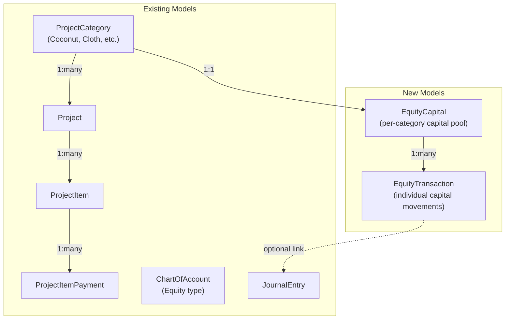
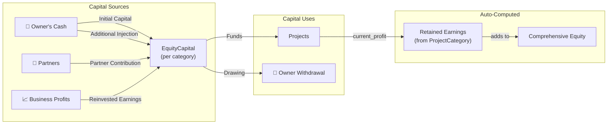

# Equity Capital Implementation Guide

> **Scope**: Full equity breakdown — initial capital, additional injections, retained earnings, owner's drawings, and partner contributions — integrated with your existing **ProjectCategory** business system.

---

## Architecture Overview



### Accounting Equation Context

```
Owner's Equity = Initial Capital
               + Additional Capital Injections
               + Partner Contributions  
               + Retained Earnings (auto-computed from project profits)
               - Owner's Drawings/Withdrawals
```

---

## Step 1 — New Models

Add these two models to [models.py](file:///c:/Users/HP/Documents/GitHub/FinancialTracker/app/models.py) after the `GlobalEntity` class (~line 1069):

```python
# ===== EQUITY CAPITAL TRACKING =====
class EquityCapital(db.Model):
    """Tracks the equity capital pool for a business category (e.g., Coconut, Cloth).
    
    Each ProjectCategory can have one EquityCapital record that aggregates
    all capital transactions (initial investment, reinvestments, drawings, etc.)
    """
    id = db.Column(db.Integer, primary_key=True)
    user_id = db.Column(db.Integer, db.ForeignKey('user.id'), nullable=False)
    category_id = db.Column(db.Integer, db.ForeignKey('project_category.id'), nullable=False, unique=True)
    
    # Initial cash capital when the business was started
    initial_capital = db.Column(db.Float, default=0.0)
    initial_capital_date = db.Column(db.DateTime, nullable=True)
    
    # Descriptive metadata
    business_name = db.Column(db.String(200), nullable=True)  # Optional alias
    notes = db.Column(db.Text, nullable=True)
    created_at = db.Column(db.DateTime, default=datetime.utcnow)
    updated_at = db.Column(db.DateTime, default=datetime.utcnow, onupdate=datetime.utcnow)
    
    # Relationships
    category = db.relationship('ProjectCategory', backref=db.backref('equity_capital', uselist=False), lazy=True)
    transactions = db.relationship('EquityTransaction', backref='equity_capital', lazy=True,
                                   cascade='all, delete-orphan', order_by='EquityTransaction.date.desc()')
    user = db.relationship('User', backref=db.backref('_user_equitycapitals', cascade='all, delete-orphan'), lazy=True)

    @property
    def total_additional_injections(self):
        """Sum of all additional cash put into the business after initial capital."""
        return sum(t.amount for t in self.transactions if t.transaction_type == 'injection')

    @property
    def total_reinvested_earnings(self):
        """Sum of profits reinvested back into the business."""
        return sum(t.amount for t in self.transactions if t.transaction_type == 'reinvestment')

    @property
    def total_partner_contributions(self):
        """Sum of capital contributed by partners."""
        return sum(t.amount for t in self.transactions if t.transaction_type == 'partner_contribution')

    @property
    def total_drawings(self):
        """Sum of owner's withdrawals/drawings from the business."""
        return sum(t.amount for t in self.transactions if t.transaction_type == 'drawing')

    @property
    def total_equity(self):
        """Current total equity = initial + injections + reinvestments + partner - drawings."""
        return (self.initial_capital
                + self.total_additional_injections
                + self.total_reinvested_earnings
                + self.total_partner_contributions
                - self.total_drawings)

    @property
    def retained_earnings(self):
        """Auto-computed from category's current profit (income - expenses).
        This represents undrawn/unreinvested profits still in the business.
        """
        if self.category:
            return self.category.current_profit
        return 0.0

    @property
    def comprehensive_equity(self):
        """Total equity including un-reinvested retained earnings."""
        return self.total_equity + self.retained_earnings

    def __repr__(self):
        return f'<EquityCapital {self.business_name or self.category.name}: {self.total_equity}>'


class EquityTransaction(db.Model):
    """Individual capital movement in or out of a business.
    
    Transaction types:
    - 'injection'             : Additional cash invested by owner
    - 'reinvestment'          : Profits ploughed back into the business
    - 'partner_contribution'  : Cash from a partner/co-investor
    - 'drawing'               : Owner withdrawing money from the business
    """
    id = db.Column(db.Integer, primary_key=True)
    user_id = db.Column(db.Integer, db.ForeignKey('user.id'), nullable=False)
    equity_capital_id = db.Column(db.Integer, db.ForeignKey('equity_capital.id'), nullable=False)
    
    transaction_type = db.Column(db.String(30), nullable=False)
    # One of: 'injection', 'reinvestment', 'partner_contribution', 'drawing'
    
    amount = db.Column(db.Float, nullable=False, default=0.0)
    date = db.Column(db.DateTime, nullable=False, default=datetime.utcnow)
    description = db.Column(db.String(300), nullable=True)
    
    # For partner contributions, optionally record partner name
    partner_name = db.Column(db.String(150), nullable=True)
    
    # Optional link to a wallet (where the money came from / went to)
    wallet_id = db.Column(db.Integer, db.ForeignKey('wallet.id'), nullable=True)
    
    # Optional link to accounting journal entry for double-entry integration
    journal_entry_id = db.Column(db.Integer, db.ForeignKey('journal_entry.id'), nullable=True)
    
    notes = db.Column(db.Text, nullable=True)
    created_at = db.Column(db.DateTime, default=datetime.utcnow)
    
    # Relationships
    wallet = db.relationship('Wallet', lazy=True)
    journal_entry = db.relationship('JournalEntry', lazy=True)
    user = db.relationship('User', backref=db.backref('_user_equitytransactions', cascade='all, delete-orphan'), lazy=True)

    @property
    def is_inflow(self):
        """Whether this transaction adds to equity."""
        return self.transaction_type in ('injection', 'reinvestment', 'partner_contribution')

    def __repr__(self):
        return f'<EquityTransaction {self.transaction_type}: {self.amount}>'
```

> [!IMPORTANT]
> The `EquityCapital` has a **`unique=True`** constraint on `category_id` — each business category gets exactly one equity capital record. This prevents duplicates and makes lookups simple.

---

## Step 2 — Database Migration

After adding the models, generate and apply the migration:

```bash
# Inside your pipenv shell
flask db migrate -m "Add EquityCapital and EquityTransaction models"
flask db upgrade
```

---

## Step 3 — Routes

Create a new file [routes_equity.py](file:///c:/Users/HP/Documents/GitHub/FinancialTracker/app/routes_equity.py):

```python
from flask import Blueprint, render_template, request, redirect, url_for, flash
from flask_login import login_required, current_user
from . import db
from .models import (EquityCapital, EquityTransaction, ProjectCategory, Wallet,
                     get_or_seed_project_categories)
from datetime import datetime

equity_bp = Blueprint('equity', __name__, url_prefix='/equity')

TRANSACTION_TYPES = [
    ('injection', 'Additional Capital Injection', '💰', 'inflow'),
    ('reinvestment', 'Reinvested Earnings', '🔄', 'inflow'),
    ('partner_contribution', 'Partner Contribution', '🤝', 'inflow'),
    ('drawing', 'Owner Drawing/Withdrawal', '📤', 'outflow'),
]


@equity_bp.route('/')
@login_required
def equity_overview():
    """Dashboard showing equity capital across all business categories."""
    categories = get_or_seed_project_categories(current_user.id)
    
    # Ensure each category has an EquityCapital record
    equity_records = []
    for cat in categories:
        ec = EquityCapital.query.filter_by(
            user_id=current_user.id, category_id=cat.id
        ).first()
        if not ec:
            ec = EquityCapital(user_id=current_user.id, category_id=cat.id)
            db.session.add(ec)
        equity_records.append(ec)
    db.session.commit()
    
    # Aggregate stats
    total_initial = sum(ec.initial_capital for ec in equity_records)
    total_injections = sum(ec.total_additional_injections for ec in equity_records)
    total_reinvested = sum(ec.total_reinvested_earnings for ec in equity_records)
    total_partner = sum(ec.total_partner_contributions for ec in equity_records)
    total_drawings = sum(ec.total_drawings for ec in equity_records)
    total_equity = sum(ec.total_equity for ec in equity_records)
    total_retained = sum(ec.retained_earnings for ec in equity_records)
    comprehensive_total = sum(ec.comprehensive_equity for ec in equity_records)
    
    wallets = Wallet.query.filter_by(user_id=current_user.id).all()
    
    return render_template('equity_capital.html',
        equity_records=equity_records,
        categories=categories,
        wallets=wallets,
        transaction_types=TRANSACTION_TYPES,
        total_initial=total_initial,
        total_injections=total_injections,
        total_reinvested=total_reinvested,
        total_partner=total_partner,
        total_drawings=total_drawings,
        total_equity=total_equity,
        total_retained=total_retained,
        comprehensive_total=comprehensive_total,
    )


@equity_bp.route('/setup/<int:category_id>', methods=['POST'])
@login_required
def setup_initial_capital(category_id):
    """Set or update the initial capital for a business category."""
    cat = ProjectCategory.query.filter_by(id=category_id, user_id=current_user.id).first_or_404()
    
    ec = EquityCapital.query.filter_by(user_id=current_user.id, category_id=category_id).first()
    if not ec:
        ec = EquityCapital(user_id=current_user.id, category_id=category_id)
        db.session.add(ec)
    
    try:
        ec.initial_capital = float(request.form.get('initial_capital', 0))
        date_str = request.form.get('initial_capital_date')
        ec.initial_capital_date = datetime.strptime(date_str, '%Y-%m-%d') if date_str else None
        ec.business_name = request.form.get('business_name', '').strip() or None
        ec.notes = request.form.get('notes', '').strip() or None
        
        db.session.commit()
        flash(f'Initial capital set for {cat.name}.', 'success')
    except Exception as e:
        db.session.rollback()
        flash(f'Error setting initial capital: {str(e)}', 'danger')
    
    return redirect(url_for('equity.equity_overview'))


@equity_bp.route('/transaction/add/<int:equity_id>', methods=['POST'])
@login_required
def add_transaction(equity_id):
    """Record a new equity transaction (injection, reinvestment, drawing, etc.)."""
    ec = EquityCapital.query.filter_by(id=equity_id, user_id=current_user.id).first_or_404()
    
    try:
        txn_type = request.form.get('transaction_type')
        if txn_type not in [t[0] for t in TRANSACTION_TYPES]:
            flash('Invalid transaction type.', 'danger')
            return redirect(url_for('equity.equity_overview'))
        
        amount = float(request.form.get('amount', 0))
        if amount <= 0:
            flash('Amount must be greater than zero.', 'danger')
            return redirect(url_for('equity.equity_overview'))
        
        date_str = request.form.get('date')
        txn_date = datetime.strptime(date_str, '%Y-%m-%d') if date_str else datetime.utcnow()
        
        wallet_id = request.form.get('wallet_id')
        partner_name = request.form.get('partner_name', '').strip() or None
        
        txn = EquityTransaction(
            user_id=current_user.id,
            equity_capital_id=equity_id,
            transaction_type=txn_type,
            amount=amount,
            date=txn_date,
            description=request.form.get('description', '').strip() or None,
            partner_name=partner_name,
            wallet_id=int(wallet_id) if wallet_id else None,
            notes=request.form.get('notes', '').strip() or None,
        )
        
        db.session.add(txn)
        db.session.commit()
        
        type_label = dict((t[0], t[1]) for t in TRANSACTION_TYPES).get(txn_type, txn_type)
        flash(f'{type_label} of {amount:,.2f} recorded for {ec.category.name}.', 'success')
    except Exception as e:
        db.session.rollback()
        flash(f'Error recording transaction: {str(e)}', 'danger')
    
    return redirect(url_for('equity.equity_overview'))


@equity_bp.route('/transaction/delete/<int:txn_id>', methods=['POST'])
@login_required
def delete_transaction(txn_id):
    """Delete an equity transaction."""
    txn = EquityTransaction.query.filter_by(id=txn_id, user_id=current_user.id).first_or_404()
    
    try:
        db.session.delete(txn)
        db.session.commit()
        flash('Transaction deleted.', 'success')
    except Exception as e:
        db.session.rollback()
        flash(f'Error deleting transaction: {str(e)}', 'danger')
    
    return redirect(url_for('equity.equity_overview'))
```

---

## Step 4 — Register the Blueprint

Add the equity blueprint in [\_\_init\_\_.py](file:///c:/Users/HP/Documents/GitHub/FinancialTracker/app/__init__.py). Add these two lines following the same pattern as other blueprints:

```diff
 from .routes_shared_wallets import shared_wallets_bp
+from .routes_equity import equity_bp

 ...

 app.register_blueprint(shared_wallets_bp)
+app.register_blueprint(equity_bp)
```

---

## Step 5 — Template

Create [equity_capital.html](file:///c:/Users/HP/Documents/GitHub/FinancialTracker/app/templates/equity_capital.html) following your existing design patterns (the glassmorphism + gradient style from `projects.html` and `category_projects.html`).

The template should contain these sections:

### 5a. Header + Navigation
```html

Equity Capital - Financial Tracker
Equity Capital


<div class="max-w-7xl mx-auto space-y-8">
    <!-- Header -->
    <div class="flex flex-col sm:flex-row justify-between items-start sm:items-center gap-4">
        <div>
            <h1 class="text-3xl font-black font-heading text-text m-0 tracking-tight bg-clip-text text-transparent bg-gradient-to-r from-primary to-purple-500 italic uppercase">
                Equity Capital
            </h1>
            <p class="text-text-muted mt-1 text-sm font-medium">
                Track initial investment, additional injections, reinvested earnings, and owner drawings across your businesses.
            </p>
        </div>
    </div>
```

### 5b. Aggregate Summary Cards (6 cards in a grid)

| Card | Value | Color |
|------|-------|-------|
| Initial Capital | `total_initial` | primary |
| Additional Injections | `total_injections` | info/blue |
| Reinvested Earnings | `total_reinvested` | success/green |
| Partner Contributions | `total_partner` | purple |
| Owner Drawings | `total_drawings` | danger/red |
| **Total Equity** | `comprehensive_total` | gradient primary→purple (highlighted) |

### 5c. Per-Category Equity Cards

Loop through `equity_records` showing each category's equity breakdown:

```html

<div class="bg-surface/40 backdrop-blur-xl rounded-3xl border border-white/10 shadow-2xl p-6 space-y-4">
    <div class="flex justify-between items-center">
        <h3 class="text-xl font-black text-text">{{ ec.category.name }}</h3>
        <span class="text-2xl font-black text-successtext-danger">
            {{ current_user.default_currency }} {{ "{:,.2f}".format(ec.comprehensive_equity) }}
        </span>
    </div>
    
    <!-- Equity breakdown mini-grid -->
    <div class="grid grid-cols-2 md:grid-cols-3 gap-3">
        <!-- Initial Capital -->
        <!-- + Injections -->
        <!-- + Reinvested -->
        <!-- + Partner -->
        <!-- - Drawings -->
        <!-- = Retained Earnings (auto from category profit) -->
    </div>
    
    <!-- Setup / Edit Initial Capital form -->
    <!-- Add Transaction button (opens modal) -->
    
    <!-- Transaction History table -->
    <div class="mt-4">
        <h4 class="text-sm font-black uppercase text-text-muted mb-2">Transaction History</h4>
        
        <div class="flex justify-between items-center py-2 border-b border-border/30">
            <div>
                <span class="text-successtext-danger font-bold">
                    +-
                    {{ current_user.default_currency }} {{ "{:,.2f}".format(txn.amount) }}
                </span>
                <span class="text-xs text-text-muted ml-2">{{ txn.description or txn.transaction_type }}</span>
            </div>
            <div class="flex items-center gap-2">
                <span class="text-xs text-text-muted">{{ txn.date.strftime('%d %b %Y') }}</span>
                <form method="POST" action="{{ url_for('equity.delete_transaction', txn_id=txn.id) }}">
                    <button type="submit" class="text-danger/60 hover:text-danger">
                        <i data-lucide="trash-2" class="w-3.5 h-3.5"></i>
                    </button>
                </form>
            </div>
        </div>
        
    </div>
</div>

```

### 5d. Modals

You'll need two modals (same pattern as your existing project modals):

1. **Setup Initial Capital Modal** — form to set `initial_capital`, `initial_capital_date`, `business_name`
2. **Add Transaction Modal** — form with dropdown for `transaction_type`, `amount`, `date`, `description`, optional `partner_name` (shown when type is `partner_contribution`), optional `wallet_id`

---

## Step 6 — Add Navigation Link

Add the equity page to your sidebar/nav in [base.html](file:///c:/Users/HP/Documents/GitHub/FinancialTracker/app/templates/base.html). Look for the Investments or Projects nav group and add:

```html
<a href="{{ url_for('equity.equity_overview') }}" class="...">
    <i data-lucide="landmark" class="w-5 h-5"></i>
    Equity Capital
</a>
```

---

## Step 7 — Optional Accounting Integration

To create double-entry journal entries automatically when equity transactions are recorded, add this helper to the `add_transaction` route:

```python
# After creating the EquityTransaction, optionally create a journal entry
from .models import ChartOfAccount, JournalEntry

# Find or create Equity and Cash accounts
equity_account = ChartOfAccount.query.filter_by(
    user_id=current_user.id, account_type='Equity'
).first()
cash_account = ChartOfAccount.query.filter_by(
    user_id=current_user.id, account_type='Asset'
).first()

if equity_account and cash_account:
    if txn.is_inflow:
        # DR Cash (Asset), CR Owner's Equity
        je = JournalEntry(
            user_id=current_user.id,
            date=txn_date,
            description=f"Equity {txn_type}: {txn.description or ec.category.name}",
            debit_account_id=cash_account.id,
            credit_account_id=equity_account.id,
            amount=amount,
            reference=f"EQ-{txn.id}",
        )
    else:
        # DR Owner's Equity, CR Cash (drawing)
        je = JournalEntry(
            user_id=current_user.id,
            date=txn_date,
            description=f"Owner drawing: {txn.description or ec.category.name}",
            debit_account_id=equity_account.id,
            credit_account_id=cash_account.id,
            amount=amount,
            reference=f"EQ-{txn.id}",
        )
    
    # Update account balances
    cash_account.balance += amount if txn.is_inflow else -amount
    equity_account.balance += amount if txn.is_inflow else -amount
    
    db.session.add(je)
    txn.journal_entry_id = je.id
    db.session.commit()
```

---

## Data Flow Summary



---

## File Checklist

| File | Action | Status |
|------|--------|--------|
| [`models.py`](file:///c:/Users/HP/Documents/GitHub/FinancialTracker/app/models.py) | Add `EquityCapital` + `EquityTransaction` classes | ⬜ |
| `routes_equity.py` (new) | Create blueprint with CRUD routes | ⬜ |
| [`__init__.py`](file:///c:/Users/HP/Documents/GitHub/FinancialTracker/app/__init__.py) | Register `equity_bp` | ⬜ |
| `templates/equity_capital.html` (new) | Dashboard template | ⬜ |
| [`base.html`](file:///c:/Users/HP/Documents/GitHub/FinancialTracker/app/templates/base.html) | Add nav link | ⬜ |
| Migration | `flask db migrate` + `flask db upgrade` | ⬜ |

> [!TIP]
> The `retained_earnings` property on `EquityCapital` **automatically pulls** from `ProjectCategory.current_profit`, so you don't need to manually track what profits haven't been reinvested — it's always live-computed from your actual project income and expenses.
